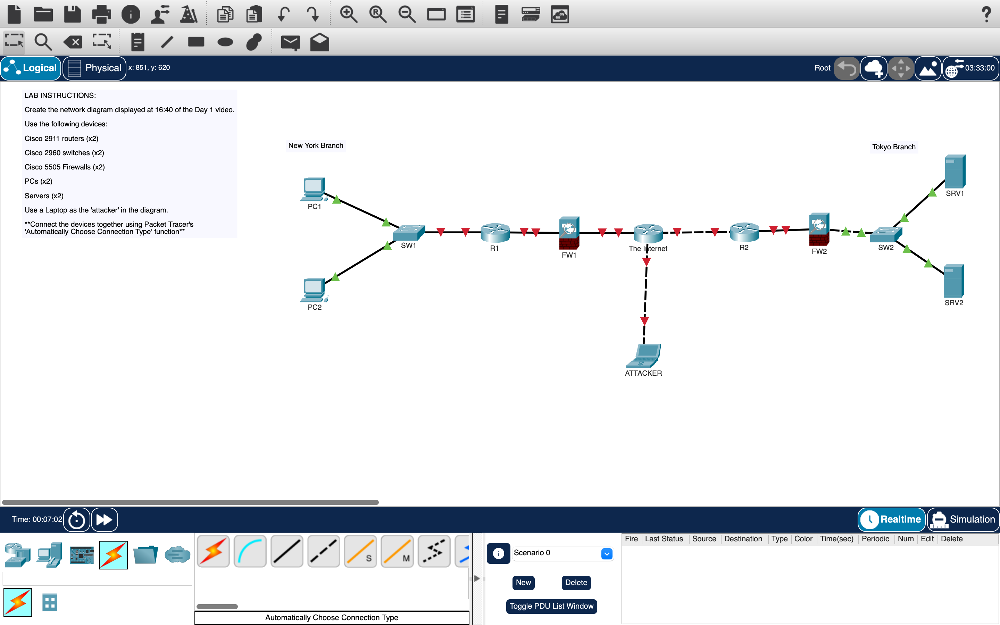

# Network Topology Lab (Packet Tracer)

## Diagram

## Objective
Build and simulate a network topology using Cisco Packet Tracer to understand how devices communicate across networks.

## Devices Used
- 2 Cisco 2911 Routers
- 2 Cisco 2960 Switches
- 2 Cisco 5505 Firewalls
- 2 PCs
- 2 Servers
- 1 Laptop (Attacker)

## What I Did
I created a network topology connecting two different locations (New York and Tokyo).

Each location had:
- PCs or Servers connected to a switch
- The switch connected to a router
- The router connected to a firewall

Both networks were connected through the internet.

I also added an attacker device connected to the internet to simulate external access.

## What I Observed
- Switches allow communication within the same network
- Routers connect different networks
- Firewalls control traffic between networks
- Data travels across multiple devices before reaching its destination

## My Understanding
This lab helped me understand how real-world networks are structured.

I learned how different devices work together to allow communication while maintaining security.

## Notes
- Switch = internal communication  
- Router = connects networks  
- Firewall = security layer  
- Internet = global connection point  

## Next Step
Learn how data flows through networks using the OSI model